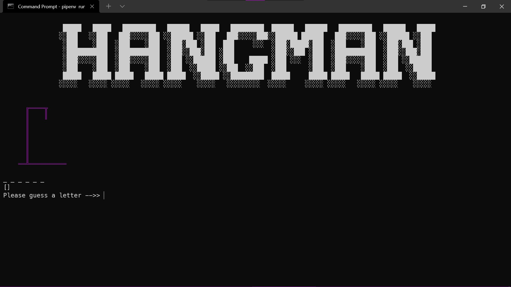
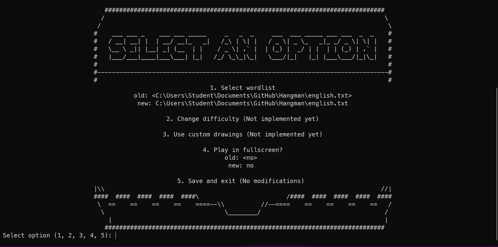
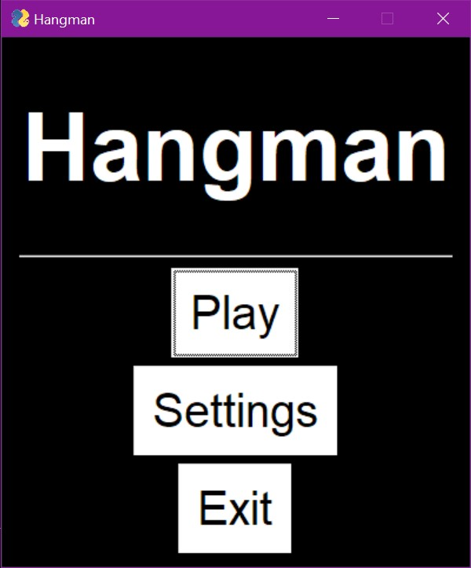

# Hangman

## Requirements
- [python 3.10](https://www.python.org/downloads/release/python-3100rc1/)
- [pipenv](https://pypi.org/project/pipenv/)

## Installation
```
git clone https://github.com/lowee1/Hangman.git
cd Hangman
pipenv install
```

## Usage
There is both a text-based and graphical user interface.

**IMPORTANT: You must run these commands inside the environment either by first running** `pipenv shell` **or by prepending** `pipenv run` **to every command.**

### TUI
`python hangman.py tui play` to play


`python hangman.py tui config` to change the settings


_the fullscreen feature for the tui just sends the f11 key so it might not always work_

### GUI
`python hangman.py gui launch` to launch the gui

_Note: the graphical settings feature has not been implemented yet_
